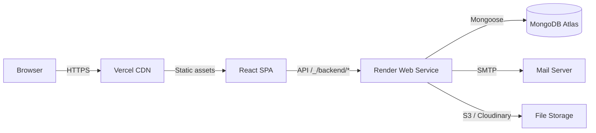

# ZENTOR — Operations Manual

> Last updated: 2026-06-03

## Architecture Overview



## Deployment Structure

| Layer | Platform | Tech | Notes |
|-------|----------|------|-------|
| Frontend | Vercel | React + Vite | Static SPA; env via Vercel dashboard |
| Backend | Render | Express (Node 20+) | Web service; env via Render dashboard |
| Database | MongoDB Atlas | M40+ cluster | Connection string via `MONGO_URI` |
| File storage | S3-compatible OR Cloudinary | | Configured by env vars |
| SMTP | Nodemailer | | Configured by env vars |

## URLs

- **Frontend (prod):** `https://<vercel-project>.vercel.app`
- **Backend API (prod):** `https://gested-1-backend.onrender.com` (or via Vercel proxy `/_/backend`)
- **Backend health:** `<backend>/health`
- **Local dev:** `http://localhost:5173` (frontend) → `http://localhost:3000` (backend)

## Environment Variables Reference

### Backend (`backend/.env` or Render dashboard)

| Variable | Required | Default | Description |
|----------|----------|---------|-------------|
| `MONGO_URI` | Yes | — | MongoDB Atlas connection string |
| `JWT_SECRET` | Yes | — | Signing key (min 32 chars for production) |
| `PORT` | No | `3000` | Express listen port |
| `NODE_ENV` | No | `development` | Set to `production` in production |
| `FRONTEND_URL` | No | — | Single allowed CORS origin |
| `FRONTEND_ORIGINS` / `CORS_ORIGINS` | No | — | Comma-separated CORS origins |
| `ALLOW_VERCEL_PREVIEWS` | No | `true` | Allow `*.vercel.app` CORS |
| `CLOUDINARY_CLOUD_NAME` | No* | — | Cloudinary cloud name |
| `CLOUDINARY_API_KEY` | No* | — | Cloudinary API key |
| `CLOUDINARY_API_SECRET` | No* | — | Cloudinary API secret |
| `CLOUDINARY_FOLDER` | No | `performia` | Upload folder prefix |
| `S3_ENDPOINT` | No* | — | S3-compatible endpoint |
| `S3_REGION` | No* | — | S3 region |
| `S3_BUCKET` | No* | — | S3 bucket name |
| `S3_ACCESS_KEY_ID` | No* | — | S3 access key |
| `S3_SECRET_ACCESS_KEY` | No* | — | S3 secret key |
| `S3_PUBLIC_BASE_URL` | No | — | Public URL prefix for S3 objects |
| `AUTOMATION_TOKEN` | No | — | Token for internal automation calls |
| `ALLOW_DEMO_SEED` | No | `false` | Enable demo seed scripts |
| `SEED_ADMIN_EMAIL` | No | — | Admin email for initial seed |
| `SEED_ADMIN_PASSWORD` | No | — | Admin password for initial seed |
| `SEED_ADMIN_NAME` | No | — | Admin display name for initial seed |
| `SEED_COMPANY_NAME` | No | — | Company name for initial seed |
| `SEED_COMPANY_SLUG` | No | — | Company slug for initial seed |
| `SEED_SCHOOL_NAME` | No | — | School name for initial seed |
| `SUPPORT_CACHE_TTL_MS` | No | `120000` | Support endpoint cache TTL |
| `SUPPORT_RATE_WINDOW_MS` | No | `60000` | Rate limit window |
| `SUPPORT_RATE_MAX_REQUESTS` | No | `20` | Max requests per window |

\* File storage is optional: either S3 _or_ Cloudinary (or neither for dev).

### Frontend (`.env.local` or Vercel dashboard)

| Variable | Required | Default | Description |
|----------|----------|---------|-------------|
| `VITE_API_URL` | No | auto-detected | Backend API base URL |

> The frontend auto-detects the API URL from `window.location.origin` in production, so `VITE_API_URL` is typically only needed for local development.

## Demo Credentials

After running `scripts/seed-pilot.mjs`:

| Role | Email | Password |
|------|-------|----------|
| Admin | `admin@demo.com` | `123456` |
| SUPER_ADMIN | `superadmin.demo@performia.test` | `Demo1234!` |
| ORG_ADMIN | `orgadmin.demo@performia.test` | `Demo1234!` |
| HR | `hr.demo@performia.test` | `Demo1234!` |
| MANAGER | `manager.demo@performia.test` | `Demo1234!` |
| EMPLOYEE | `employee.demo@performia.test` | `Demo1234!` |
| VIEWER | `viewer.demo@performia.test` | `Demo1234!` |
| AUDITOR | `auditor.demo@performia.test` | `Demo1234!` |

Additional seed data lives in `scripts/seed-demo.mjs` (richer dataset for full demos).

## Monitoring

### Health Endpoint

```
GET /health
```

Ejemplo de respuesta exitosa:
```json
{
  "ok": true,
  "service": "zentor-backend",
  "status": "ok",
  "env": "production",
  "timestamp": "2026-06-03T21:00:00.000Z",
  "uptimeSeconds": 3600,
  "version": "1.0.0",
  "database": {
    "ok": true,
    "state": "connected"
  }
}
```

- **200** = todo ok
- **503** = base de datos no conectada (aplicacion degradada)
- **Sin respuesta o timeout** = backend caido

### Monitoreo Externo Recomendado

Se recomienda **UptimeRobot** (plan gratuito suficiente) o **Better Stack**:

| Servicio | Plan gratis | Frecuencia | Alertas |
|----------|-------------|------------|---------|
| [UptimeRobot](https://uptimerobot.com) | 50 monitores, 5 min intervalo | Cada 5 min | Email, Slack, SMS |
| [Better Stack](https://betterstack.com) | 3 monitores, 3 min intervalo | Cada 3 min | Email, Slack, Webhook |
| [Healthchecks.io](https://healthchecks.io) | 20 checks, ilimitado | Push desde el backend | Email, Slack, Webhook |

**Configuracion sugerida:**

```
URL: https://gested-1-backend.onrender.com/health
Intervalo: 5 minutos
Timeout: 30 segundos
Alertas: Email + Slack (canal #monitoreo)
Considerar caida cuando:
  - HTTP status != 200
  - Timeout > 30s
  - Respuesta no contiene "ok": true
```

### Logs

- **Render:** Dashboard → Service → Logs tab (streaming or historical, retention ~2 semanas)
- **Vercel:** Dashboard → Project → Functions → Logs
- **MongoDB Atlas:** Cluster → Monitoring → Logs

## Backup & Recovery (MongoDB Atlas)

### Backup Automatico de Atlas

MongoDB Atlas M10+ incluye snapshots automaticos:

1. Ir a [cloud.mongodb.com](https://cloud.mongodb.com) → Cluster → Backup
2. Verificar frecuencia configurada:
   - M10: cada 24h, retencion 1 dia
   - M20: cada 12h, retencion 2 dias
   - M30+: cada 6h, retencion 7+ dias
3. Activar **PITR (Point-in-Time Recovery)** si el plan lo permite:
   - Backup → Point in Time Restore → Enable
   - Permite restaurar a cualquier minuto dentro de la ventana de retencion

### Backup Manual (mongodump)

Para backup adicional fuera de Atlas:

```bash
# Respetar .gitignore y no committear volcados
mongodump --uri="<MONGO_URI>" --out=./backups/$(date +%Y%m%d_%H%M%S)
```

### Restore

Ver [INCIDENT_RUNBOOK.md](./INCIDENT_RUNBOOK.md#8-restore-desde-backup) para procedimiento detallado.

Resumen rapido:
1. Atlas Dashboard → Backup → seleccionar snapshot
2. Preferir "Restore to new cluster" (nunca directo a prod sin verificar)
3. Verificar datos en cluster temporal
4. Si todo ok, repeat con "Restore to current cluster"
5. Actualizar MONGO_URI si cambio el cluster

### Usuario de Base de Datos

- Crear usuario dedicado para la app (no usar usuario admin de Atlas)
- Permisos minimos: `readWrite` en la base de datos de la aplicacion
- No compartir credenciales por canales no seguros
- Rotar password cada 90 dias

### Lo que NO hacer en backup/restore

- NO restaurar directo sobre produccion sin verificar en cluster separado
- NO asumir que el snapshot mas reciente es correcto (pudo tomarse durante corrupcion)
- NO compartir MONGO_URI por Slack/email/otros canales no seguros
- NO hacer restore mientras la app esta siendo usada activamente
- NO olvidar actualizar la URI si se migra a otro cluster
- NO committear volcados de base de datos al repositorio

## Common Operational Tasks

### Seed / Reset Demo Data

```bash
# Run pilot seed (safe, idempotent)
SEED_CONFIRM=1 node scripts/seed-pilot.mjs

# Dry-run first to see what would be created
node scripts/seed-pilot.mjs --dry-run

# Reset demo user passwords to defaults
SEED_CONFIRM=1 node scripts/seed-pilot.mjs --reset-passwords
```

### Run Validation Matrix

```bash
node scripts/seedValidationMatrix.js
```

### Post-Deploy Smoke Test

```bash
SMOKE_API_URL=https://gested-1-backend.onrender.com \
  SMOKE_EMAIL=admin@demo.com \
  SMOKE_PASSWORD=123456 \
  node scripts/smokeTestPostDeploy.js
```

### Rollback Deployment

- **Vercel:** Dashboard → Project → Deployments → ⋯ → Promote to Production (previous deployment)
- **Render:** Dashboard → Service → Manual Deploy → Deploy last successful deploy
- **Git tag:** Ver [INCIDENT_RUNBOOK.md#9-rollback-por-tag](./INCIDENT_RUNBOOK.md#9-rollback-por-tag)

## Troubleshooting

### 504 Gateway Timeout

- Backend response exceeds Render's 30s (free) / 300s (paid) timeout.
- Check for slow MongoDB queries: add indexes or optimize aggregation pipelines.
- Check `SUPPORT_CACHE_TTL_MS` — reduce if cache miss is expensive.

### CORS Errors

- Verify `FRONTEND_URL` or `FRONTEND_ORIGINS` includes the requesting domain.
- For Vercel preview deployments, ensure `ALLOW_VERCEL_PREVIEWS=true` (default).
- If backend is accessed via Vercel proxy (`/_/backend`), the origin is the Vercel domain.

### JWT Expired

- Users see `401` with token expiry message.
- Default JWT expiry is configured in `routes/auth.routes.js`.
- No way to extend individual tokens — user must re-login.

### Seed Script Fails

```bash
# Common causes:
# 1. Backend not running — start with `npm start` from backend/
# 2. Network error — check MONGO_URI and connectivity
# 3. Duplicate key — seed is idempotent, check error for specific conflict

# Debug with:
node scripts/seed-pilot.mjs --dry-run
# Then check backend logs for actual error.
```

### Login Returns 401

- Verify credentials against the correct environment (dev vs prod).
- Check if `SEED_ADMIN_EMAIL` / `SEED_ADMIN_PASSWORD` were changed after initial seed.
- If using the demo tenant, ensure `scripts/seed-pilot.mjs` was executed.
- Backend logs will show `POST /auth/login` result with reason.
